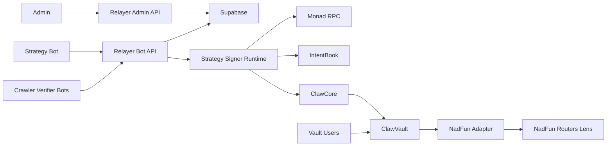

## Executive summary
The highest-risk themes are integrity attacks across fund boundaries in relayer storage, trust in offchain state acknowledgements without onchain receipt verification, and privileged governance control of upgradeable contracts. The most security-critical areas are `/Users/wiimdy/agent/packages/relayer/lib/supabase.ts`, `/Users/wiimdy/agent/packages/relayer/app/api/v1/funds/[fundId]/intents/[intentHash]/onchain-attested/route.ts`, and upgrade/config paths in `/Users/wiimdy/agent/packages/contracts/src/ClawCore.sol` and `/Users/wiimdy/agent/packages/contracts/src/ClawVault4626.sol`.

## Scope and assumptions
In scope:
- `/Users/wiimdy/agent/packages/contracts/src/*`
- `/Users/wiimdy/agent/packages/relayer/app/api/v1/*`
- `/Users/wiimdy/agent/packages/relayer/lib/*`
- `/Users/wiimdy/agent/packages/relayer/supabase/schema.sql`
- `/Users/wiimdy/agent/packages/agents/src/*`

Out of scope:
- Frontend UI UX risks
- CI/CD supply-chain hardening details
- External infra configuration details not stored in repo (Supabase RLS, WAF, network ACL)

Assumptions:
- Production uses HTTPS/TLS between bots and relayer.
- Bot API keys and admin credentials are secret-managed and rotated.
- Funds are intended to be isolated tenants.
- Onchain contracts are deployed with owner addresses controlled by trusted governance.
- Supabase schema shown is authoritative for prod tables.

Open questions that materially change ranking:
- Is Supabase RLS enabled for all tables, and are policies deny-by-default?
- Are unauthenticated read endpoints (`/status`, `/metrics`, `/executions`, SSE feeds) intentionally public?
- Is there an external verifier that checks `txHash` receipts before accepting onchain ACK endpoints?

## System model
### Primary components
| Entity | Type | Core functions | Evidence |
| --- | --- | --- | --- |
| Fund admin/operator | Human + privileged Web2 role | Bootstrap funds, set strategy bot, persist deployment metadata | `/Users/wiimdy/agent/packages/relayer/app/api/v1/funds/bootstrap/route.ts`, `/Users/wiimdy/agent/packages/relayer/lib/authz.ts` |
| Strategy bot (offchain) | Service account | Propose intents, register bots, fetch onchain bundle, ack execution state | `/Users/wiimdy/agent/packages/relayer/app/api/v1/funds/[fundId]/intents/propose/route.ts`, `/Users/wiimdy/agent/packages/relayer/app/api/v1/funds/[fundId]/bots/register/route.ts` |
| Crawler bot | Service account | Submit claims | `/Users/wiimdy/agent/packages/relayer/app/api/v1/funds/[fundId]/claims/route.ts` |
| Verifier bot | Service account | Submit claim/intent attestations | `/Users/wiimdy/agent/packages/relayer/app/api/v1/funds/[fundId]/attestations/route.ts`, `/Users/wiimdy/agent/packages/relayer/app/api/v1/funds/[fundId]/intents/attestations/batch/route.ts` |
| Relayer API server | Web2 control plane | AuthN/AuthZ, claim-intent lifecycle, READY_FOR_ONCHAIN transitions, execution state APIs | `/Users/wiimdy/agent/packages/relayer/lib/bot-auth.ts`, `/Users/wiimdy/agent/packages/relayer/lib/aggregator.ts` |
| Supabase DB | Data plane | Stores funds, bots, subject state, attestations, intents, jobs | `/Users/wiimdy/agent/packages/relayer/supabase/schema.sql`, `/Users/wiimdy/agent/packages/relayer/lib/supabase.ts` |
| Strategy signer runtime | Offchain executor | Reads ready payloads, performs dry-run checks, submits direct EOA transactions, ACKs relayer | `/Users/wiimdy/agent/packages/agents/src/strategy-cli.ts` |
| ClawFundFactory | Onchain contract | Deploys per-fund proxy stack and transfers ownership | `/Users/wiimdy/agent/packages/contracts/src/ClawFundFactory.sol` |
| IntentBook | Onchain contract | Strategy-only proposal, weighted verifier attestations, intent approval | `/Users/wiimdy/agent/packages/contracts/src/IntentBook.sol` |
| ClawCore | Onchain contract | Executor-only settlement, policy and allowlist-hash checks, dry-run diagnostics | `/Users/wiimdy/agent/packages/contracts/src/ClawCore.sol` |
| ClawVault4626 | Onchain contract | User deposits/withdrawals, core-gated trade execution, adapter/token allowlists, gas reserve | `/Users/wiimdy/agent/packages/contracts/src/ClawVault4626.sol` |
| NadfunExecutionAdapter | Onchain integration | NadFun buy/sell execution and quote checking against lens/router | `/Users/wiimdy/agent/packages/contracts/src/adapters/NadfunExecutionAdapter.sol` |
| External dependencies | Third-party | Monad RPC providers, NadFun routers/lens | `/Users/wiimdy/agent/packages/agents/.env.example`, `/Users/wiimdy/agent/packages/contracts/src/interfaces/INadFunLens.sol` |

### Data flows and trust boundaries
- Internet bot client -> Relayer API.
Data types: bot id/key headers, claims, attestations, intents.
Channel: HTTPS HTTP API.
Security guarantees: static API-key auth + scope checks + fund-role checks.
Validation: JSON parse, address equality checks between payload and registered bot address.
Evidence: `/Users/wiimdy/agent/packages/relayer/lib/bot-auth.ts`, `/Users/wiimdy/agent/packages/relayer/lib/fund-bot-authz.ts`.

- Admin browser session -> Admin routes (`/funds`, `/funds/bootstrap`).
Data types: fund metadata, deployment config.
Channel: NextAuth session cookie.
Security guarantees: `requireAdminSession` against env-backed admin IDs.
Validation: strong input parsing for bootstrap fields.
Evidence: `/Users/wiimdy/agent/packages/relayer/lib/authz.ts`, `/Users/wiimdy/agent/packages/relayer/app/api/v1/funds/bootstrap/route.ts`.

- Relayer API -> Supabase.
Data types: fund config, intents, claims, attestations, execution jobs.
Channel: Supabase HTTP API.
Security guarantees: relies on Supabase key/policies; app-level checks before writes.
Validation: partial in app code; DB uniqueness constraints.
Evidence: `/Users/wiimdy/agent/packages/relayer/lib/supabase.ts`, `/Users/wiimdy/agent/packages/relayer/supabase/schema.sql`.

- Relayer aggregator -> Subject state transitions.
Data types: verified attestation envelopes, weighted totals, READY_FOR_ONCHAIN status.
Channel: in-process function calls.
Security guarantees: EIP-712 verification and weight threshold evaluation.
Validation: verifier allowlist + snapshot membership checks.
Evidence: `/Users/wiimdy/agent/packages/relayer/lib/aggregator.ts`, `/Users/wiimdy/agent/packages/relayer/lib/validator-snapshot.ts`.

- Strategy signer runtime -> Relayer onchain bundle/payload and ACK routes.
Data types: intent attestation bundle, execution payload, tx hashes, failure reasons.
Channel: HTTPS HTTP API.
Security guarantees: same bot API auth/scope/role checks.
Validation: tx hash shape validation only at ACK endpoints.
Evidence: `/Users/wiimdy/agent/packages/agents/src/strategy-cli.ts`, `/Users/wiimdy/agent/packages/relayer/app/api/v1/funds/[fundId]/intents/[intentHash]/onchain-attested/route.ts`.

- Strategy signer runtime -> Monad RPC.
Data types: signed EOA transactions, contract call data.
Channel: JSON-RPC.
Security guarantees: chain signature ownership and receipt verification.
Validation: local dry-run gate before execution.
Evidence: `/Users/wiimdy/agent/packages/agents/src/strategy-cli.ts`.

- Executor/Strategy -> Onchain contracts.
Data types: intent hash, execution request, adapter data.
Channel: EVM calls/transactions.
Security guarantees: `onlyStrategyAgent`, `onlyExecutor`, allowlist hash checks, token/adapter allowlists.
Validation: `validateIntentExecution` and `dryRunIntentExecution`.
Evidence: `/Users/wiimdy/agent/packages/contracts/src/IntentBook.sol`, `/Users/wiimdy/agent/packages/contracts/src/ClawCore.sol`, `/Users/wiimdy/agent/packages/contracts/src/ClawVault4626.sol`.

- Vault/adapter -> NadFun routers and lens.
Data types: buy/sell params, quote requests.
Channel: EVM external calls.
Security guarantees: router allowlist in adapter and quote router-match checks.
Validation: deadline, token consistency, amountOutMin checks.
Evidence: `/Users/wiimdy/agent/packages/contracts/src/adapters/NadfunExecutionAdapter.sol`.

#### Diagram

## Assets and security objectives
| Asset | Why it matters | Security objective (C/I/A) |
| --- | --- | --- |
| Fund intent/claim state (`subject_state`, `intents`, `claims`) | Drives approval/execution lifecycle and room decisions | I, A |
| Bot credentials (`BOT_API_KEYS`, bot scopes) | Gatekeeper for all bot write APIs | C, I |
| Admin credentials/session | Control fund bootstrap and strategy bot identity | C, I |
| Onchain ownership and upgrade authority | Can alter executor/core/vault logic and policy gates | I |
| Execution route payload (`adapterData`, allowlist hash linkage) | Controls actual trade venue and settlement constraints | I |
| Vault assets and gas reserve | Direct financial value | C, I, A |
| Supabase data integrity across funds | Multi-fund tenant isolation | I |
| Operational telemetry and event feeds | Operational awareness and potentially sensitive strategy metadata | C, A |

## Attacker model
### Capabilities
- Internet attacker can call public endpoints and attempt bot/admin credential theft.
- Malicious or compromised bot account can call any scoped endpoint for its role.
- Malicious strategy bot can submit fake ACKs unless tx verification exists.
- Insider with owner key can change config/upgrade before freeze.
- Adversary can spam unauthenticated read endpoints/SSE for availability pressure.

### Non-capabilities
- Cannot bypass onchain `onlyExecutor`/`onlyCore`/`onlyStrategyAgent` without key compromise.
- Cannot forge EIP-712 signatures without verifier private keys.
- Cannot bypass allowlist hash checks in `ClawCore` when constraints are correctly set.

## Entry points and attack surfaces
| Surface | How reached | Trust boundary | Notes | Evidence (repo path / symbol) |
| --- | --- | --- | --- | --- |
| `POST /api/v1/funds/bootstrap` | Admin session | Admin -> Relayer | Deploys and persists authoritative fund config | `/Users/wiimdy/agent/packages/relayer/app/api/v1/funds/bootstrap/route.ts` |
| `POST /api/v1/funds/{fundId}/claims` | Bot key + scope + role | Bot -> Relayer | Crawler claim ingestion | `/Users/wiimdy/agent/packages/relayer/app/api/v1/funds/[fundId]/claims/route.ts` |
| `POST /api/v1/funds/{fundId}/attestations` | Bot key + verifier role | Bot -> Relayer | Claim attestation ingestion | `/Users/wiimdy/agent/packages/relayer/app/api/v1/funds/[fundId]/attestations/route.ts` |
| `POST /api/v1/funds/{fundId}/intents/propose` | Strategy bot key | Bot -> Relayer | Intent creation and allowlist hash binding | `/Users/wiimdy/agent/packages/relayer/app/api/v1/funds/[fundId]/intents/propose/route.ts` |
| `POST /api/v1/funds/{fundId}/intents/attestations/batch` | Verifier bot key | Bot -> Relayer | Intent attestation ingestion and threshold path | `/Users/wiimdy/agent/packages/relayer/app/api/v1/funds/[fundId]/intents/attestations/batch/route.ts` |
| Onchain ACK routes (`onchain-attested/executed/failed`) | Strategy bot key | Bot -> Relayer | Only shape/state checks; no chain receipt verification | `/Users/wiimdy/agent/packages/relayer/app/api/v1/funds/[fundId]/intents/[intentHash]/onchain-attested/route.ts`, `/Users/wiimdy/agent/packages/relayer/app/api/v1/funds/[fundId]/intents/[intentHash]/onchain-executed/route.ts` |
| `GET /api/v1/executions` | Public | Internet -> Relayer | No auth guard visible | `/Users/wiimdy/agent/packages/relayer/app/api/v1/executions/route.ts` |
| SSE events + status/snapshot/metrics GET | Public | Internet -> Relayer | Data exposure and possible connection exhaustion | `/Users/wiimdy/agent/packages/relayer/app/api/v1/funds/[fundId]/events/claims/route.ts`, `/Users/wiimdy/agent/packages/relayer/app/api/v1/metrics/route.ts` |
| `ClawCore.executeIntent` | Executor onchain tx | Executor -> Core | Settlement gate with policy checks | `/Users/wiimdy/agent/packages/contracts/src/ClawCore.sol` |
| `ClawVault4626.executeTrade` | Core-only | Core -> Vault | Asset movement to adapter and PnL accounting | `/Users/wiimdy/agent/packages/contracts/src/ClawVault4626.sol` |
| `NadfunExecutionAdapter.execute` | Vault call path | Vault -> Adapter -> NadFun | External venue dependency and router checks | `/Users/wiimdy/agent/packages/contracts/src/adapters/NadfunExecutionAdapter.sol` |
| Participant source fetch | Bot-provided source URL | Internet URL -> Agent | Host allowlist/private-host checks present | `/Users/wiimdy/agent/packages/agents/src/skills/participant/index.ts` |

## Top abuse paths
1. Cross-fund state collision integrity break.
Attacker goal: corrupt another fund lifecycle.
Steps: submit same `subject_hash` in fund A -> DB uniqueness uses `(subject_type, subject_hash)` only -> updates in `upsertSubjectState` and attestation uniqueness collide across funds -> fund B lifecycle blocked or miscounted.
Impact: multi-tenant integrity failure.

2. Fake onchain approval ACK.
Attacker goal: force relayer to mark intent approved without real chain confirmation.
Steps: compromise strategy bot API key -> call `onchain-attested` with any 32-byte txHash -> relayer marks `subject_state/intents` approved and queues execution.
Impact: offchain state divergence and execution pipeline corruption.

3. Fake execution success ACK.
Attacker goal: hide failed onchain execution.
Steps: compromised strategy bot calls `onchain-executed` with fake tx hash -> job marked `EXECUTED` -> no retries triggered.
Impact: silent settlement failure and monitoring blind spot.

4. Owner-key rug via mutable config/upgrade.
Attacker goal: drain/redirect vault assets.
Steps: owner changes core/token/adapter permissions or upgrades implementation before freeze -> execute malicious trade path.
Impact: direct loss of fund assets.

5. Bot-key privilege abuse.
Attacker goal: submit malicious intents/attestations.
Steps: steal strategy/verifier/crawler bot key -> pass header auth and scope checks -> poison claim/intent lifecycle.
Impact: integrity loss, invalid trading decisions.

6. Public endpoint reconnaissance and data leakage.
Attacker goal: map strategy and operations.
Steps: call unauthenticated status/snapshot/claims/executions/metrics/events endpoints -> extract trading metadata and operations cadence.
Impact: confidentiality loss and front-running intelligence.

7. Supabase policy misconfiguration exploitation.
Attacker goal: direct DB tampering.
Steps: obtain/use anon key if RLS permissive -> write directly to tables bypassing API checks.
Impact: systemic integrity compromise.

8. Availability attack via SSE/read flood.
Attacker goal: degrade relayer availability.
Steps: open many SSE streams and high-frequency public reads -> resource exhaustion.
Impact: delayed or dropped bot operations.

9. External dependency manipulation/outage.
Attacker goal: degrade execution quality or cause losses.
Steps: NadFun router/lens behavior changes or RPC/bundler outage -> stale/failed execution despite prechecks.
Impact: execution failure, slippage risk, operational disruption.

## Threat model table
| Threat ID | Threat source | Prerequisites | Threat action | Impact | Impacted assets | Existing controls (evidence) | Gaps | Recommended mitigations | Detection ideas | Likelihood | Impact severity | Priority |
| --- | --- | --- | --- | --- | --- | --- | --- | --- | --- | --- | --- | --- |
| TM-001 | External bot / tenant crossover | Attacker can submit a colliding subject hash in another fund | Exploit global uniqueness and non-fund-scoped updates in subject/attestation tables | Cross-fund state corruption and false conflicts | Subject state integrity, multi-tenant isolation | Fund role checks at API layer (`requireFundBotRole`) | DB keys and update queries omit `fund_id` for uniqueness/paths | Change uniques to `(fund_id, subject_type, subject_hash[, verifier])`, update all selectors/updates to include `fund_id`, add migration + backfill checks | Alert on same `subject_hash` appearing in multiple `fund_id` | High | High | critical |
| TM-002 | Compromised strategy bot | Strategy bot API key compromised | POST fake txHash to `onchain-attested` endpoint | Relayer marks APPROVED without cryptographic tx validation | Intent lifecycle integrity | State gate requires `READY_FOR_ONCHAIN` | No chain receipt verification or tx->intent linkage check | Verify tx receipt status + logs against expected `intentHash` and contract before marking approved | Alert when ACK tx hash not found or mismatched logs | Medium | High | high |
| TM-003 | Compromised strategy bot | Strategy bot API key compromised | POST fake txHash to `onchain-executed` endpoint | Execution job marked EXECUTED even if not executed | Execution job integrity, availability of retries | Bot auth/scope and role checks | Missing onchain confirmation check | Require receipt verification against `ClawCore.executeIntent` event and `intentHash` | Alert on EXECUTED rows with missing chain event | Medium | Medium | high |
| TM-004 | Privileged owner key compromise or malicious insider | Owner key control before `freezeConfig`/`freezeUpgrades` | Repoint core/adapters, allow malicious assets, or UUPS upgrade to malicious logic | Asset theft and permanent trust failure | Vault assets, contract integrity | Access controls and optional freeze switches in contracts | Governance trust remains centralized; freeze may not be activated | Enforce timelock + multisig ownership + post-deploy freeze ceremony with monitoring | Alert on admin config/upgrade events (`CoreUpdated`, `AdapterAllowed`, upgrade txs) | Medium | High | high |
| TM-005 | Bot credential attacker | Access to any bot API key and matching bot id | Abuse scoped endpoints to submit malicious claims/intents/attestations | Wrong approvals and strategy poisoning | Claim/intent integrity | `requireBotAuth`, scopes, role checks, bot-address equality checks | Static API keys, no rotation protocol/rate-limit/replay hardening | Introduce short-lived HMAC/JWT, per-bot key rotation, IP allowlists, endpoint rate limiting | Failed auth burst alerts + unusual write-rate per botId | Medium | Medium | medium |
| TM-006 | Internet observer | Public network reachability | Query unauthenticated read/SSE endpoints for operational data | Strategy/ops metadata exposure and potential targeting | Confidentiality of strategy metadata | Some write endpoints are auth-protected | Read endpoints expose data without auth | Classify data and require auth for sensitive endpoints or provide redacted public views | Monitor anonymous traffic to read endpoints and SSE fanout | High | Medium | medium |
| TM-007 | Infrastructure/policy weakness attacker | Weak Supabase RLS or leaked anon key | Write/read directly via Supabase bypassing relayer checks | Full data-plane tampering | All DB-backed assets | App-level auth before API writes | Server uses anon/publishable key path; RLS posture not evidenced in repo | Enforce strict RLS for every table, separate server service role secret, policy tests in CI | Audit log alerts for direct table writes not originating from relayer | Medium | High | high |
| TM-008 | Availability attacker | Public endpoint access | Flood SSE/public GETs | Increased latency, missed bot windows | Availability-critical API resources | None visible for throttling | No rate limit or connection caps shown | Add per-IP limits, SSE connection quotas, caching for public reads | Alert on concurrent SSE connections and 429/5xx trend | Medium | Medium | medium |
| TM-009 | External dependency failure/manipulation | NadFun/RPC/bundler instability | Force quote mismatch, delayed inclusion, or execution failures | Trade failure/loss opportunity, possible slippage errors | Trade execution reliability and value | Dry-run checks in core and strategy CLI; router matching in adapter | External trust and liveness assumptions remain | Circuit breaker for repeated failure codes, multi-RPC fallback, bundler redundancy | Alert on dry-run failure code distribution, bundler timeout spikes | Medium | Medium | medium |
| TM-010 | URL-fetch abuse via participant pipeline | Attacker can influence source URL inputs | Attempt SSRF/internal probing via sourceRef | Internal network probing risk | Internal network confidentiality | HTTPS-only default, private host denylist, allowlist option | Misconfigured allowlist or `PARTICIPANT_ALLOW_HTTP_SOURCE=true` in prod can weaken controls | Enforce prod guardrails to forbid HTTP/private CIDRs regardless of env, DNS rebinding protections | Alert on blocked host attempts and non-HTTPS source requests | Low | Medium | low |

## Criticality calibration
Critical:
- Cross-fund integrity break that lets one tenant influence another fund lifecycle.
- Any path to unauthorized vault asset transfer by governance/config abuse without compensating controls.
- DB tampering that can force false approvals/executions at scale.

High:
- Forged onchain ACKs causing offchain/operational state divergence.
- Owner-key compromise before freeze causing malicious adapter/core reconfiguration.
- Supabase RLS gaps enabling unauthorized writes.

Medium:
- Bot key compromise contained to a single role/fund but still affecting trading flow.
- Public metadata exposure enabling strategy inference.
- SSE/read flood causing partial service degradation.

Low:
- URL fetch abuse attempts blocked by current host/protocol controls.
- Minor telemetry leakage that does not expose sensitive identifiers.
- Operational misconfigurations with limited blast radius and easy rollback.

## Focus paths for security review
| Path | Why it matters | Related Threat IDs |
| --- | --- | --- |
| `/Users/wiimdy/agent/packages/relayer/supabase/schema.sql` | Tenant isolation constraints are defined here; current uniqueness scope appears cross-fund | TM-001, TM-007 |
| `/Users/wiimdy/agent/packages/relayer/lib/supabase.ts` | Lifecycle state transitions and update filters can cross tenant boundaries if not fund-scoped | TM-001, TM-002, TM-003 |
| `/Users/wiimdy/agent/packages/relayer/lib/aggregator.ts` | Weighted threshold logic and READY_FOR_ONCHAIN transition driver | TM-001, TM-002, TM-005 |
| `/Users/wiimdy/agent/packages/relayer/app/api/v1/funds/[fundId]/intents/[intentHash]/onchain-attested/route.ts` | Approval ACK endpoint currently trusts tx hash format only | TM-002 |
| `/Users/wiimdy/agent/packages/relayer/app/api/v1/funds/[fundId]/intents/[intentHash]/onchain-executed/route.ts` | Execution ACK endpoint can finalize jobs without chain proof | TM-003 |
| `/Users/wiimdy/agent/packages/relayer/app/api/v1/executions/route.ts` | Unauthenticated job visibility surface | TM-006 |
| `/Users/wiimdy/agent/packages/relayer/app/api/v1/funds/[fundId]/events/claims/route.ts` | Public SSE stream can leak metadata and be abused for connection DoS | TM-006, TM-008 |
| `/Users/wiimdy/agent/packages/relayer/lib/bot-auth.ts` | Core bot credential handling and scope enforcement | TM-005 |
| `/Users/wiimdy/agent/packages/relayer/app/auth.config.ts` | Default auth secret fallback is risky if not overridden | TM-005 |
| `/Users/wiimdy/agent/packages/contracts/src/ClawCore.sol` | Settlement authority, allowlist-hash enforcement, executor gate | TM-004, TM-009 |
| `/Users/wiimdy/agent/packages/contracts/src/ClawVault4626.sol` | Asset custody, adapter/token controls, gas reserve flows, upgrade controls | TM-004 |
| `/Users/wiimdy/agent/packages/contracts/src/IntentBook.sol` | Strategy-only propose and verifier attestation approval logic | TM-004, TM-009 |
| `/Users/wiimdy/agent/packages/contracts/src/adapters/NadfunExecutionAdapter.sol` | External venue call integrity, router/deadline/quote constraints | TM-009 |
| `/Users/wiimdy/agent/packages/agents/src/strategy-cli.ts` | Dry-run gate and relayer ACK behavior for AA flow | TM-002, TM-003, TM-009 |
| `/Users/wiimdy/agent/packages/agents/src/skills/participant/index.ts` | SSRF hardening boundaries for source fetch | TM-010 |

## Quality check
- All discovered major entrypoints are covered in the attack-surface table.
- Every trust boundary is represented in at least one threat.
- Runtime threat model is separated from dev/CI tooling.
- Missing service-context answers are recorded as assumptions/open questions.
- Threat priorities are conditional on unresolved Supabase RLS and public endpoint intent.
