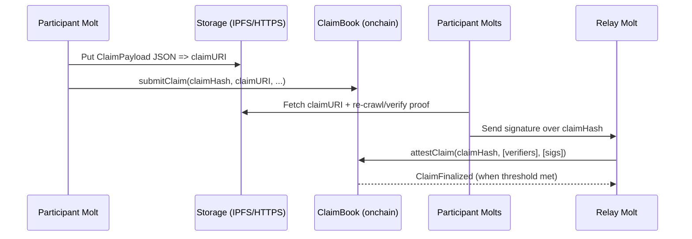
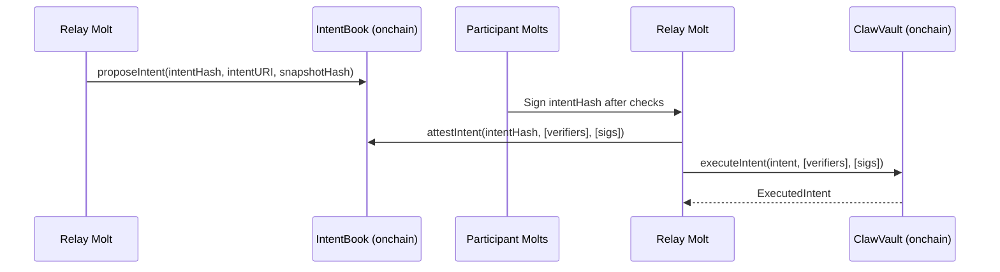

# Claw Architecture (Monad)

## 1. High-Level View
Claw is a hybrid system:
- Offchain agents crawl/verify/decide (LLM/tooling).
- Onchain contracts enforce validation thresholds, risk limits, and execution.

Key principle:
> Agents can propose anything offchain, but only validated, constrained intents are executable onchain.

## 2. Components
### 2.1 Onchain (Solidity)
Minimal contract set for MVP:
1) `AgentRegistry` (optional in MVP; can be allowlist-only)
2) `ClaimBook` (claims + claim attestations + snapshot finalization)
3) `IntentBook` (intent proposals + intent attestations)
4) `ClawVault` (funds + execution + risk controls)
5) `Points` (optional; points/reward accounting for demo)

### 2.2 Offchain
- Participant Molt(s)
  - Fetch sources, extract fields, compute ClaimPayload, publish claimURI, submit claimHash.
  - Re-crawl or verify proof, sign claimHash and/or intentHash.
  - Propose strategy ideas / intent candidates offchain.
- Relay Molt (aggregator; POC: our service)
  - Collects ECDSA signatures from verifiers, finalizes snapshots/intents, submits batch tx onchain.
- Storage
  - ClaimPayload/Intent JSON stored offchain (IPFS/S3/HTTPS).
- Proof service (optional)
  - zkTLS receipts or other evidence generation.

## 3. Data Model
### 3.1 ClaimPayload (offchain JSON)
Example schema (ASCII-only; simplify as needed):
```json
{
  "schemaId": "SOCIAL_SCORE_V1",
  "sourceType": "WEB",
  "sourceRef": "https://example.com/token/XYZ",
  "selector": ".score",
  "extracted": "12345",
  "extractedType": "uint",
  "timestamp": 1739000000,
  "responseHash": "0x...",
  "evidenceType": "RECrawlConsensus",
  "evidenceURI": "ipfs://...",
  "crawler": "0xCrawlerAgentAddress",
  "notes": "optional"
}
```

Onchain we store only:
- `claimHash` (keccak256 of a canonical encoding of ClaimPayload fields)
- `claimURI` (pointer to JSON)
- minimal metadata (schemaId, timestamp, sourceType)

### 3.2 Claim Attestation
- Verifier signs EIP-712 typed data:
  - `ClaimAttestation(claimHash, epochId, verifier, expiresAt, nonce)`
- Relay Molt submits a batch:
  - `attestClaim(claimHash, verifierAddrs[], sigs[])`

### 3.3 Snapshot
- For each epoch:
  - `snapshotHash = keccak256(abi.encode(epochId, orderedClaimHashes))`
- Snapshot stored onchain with list pointer:
  - either store only `snapshotHash` + `snapshotURI`
  - or store claimHashes array if small (MVP ok)

### 3.4 TradeIntent (offchain JSON + onchain struct)
Intent JSON:
```json
{
  "intentVersion": "V1",
  "vault": "0xVault",
  "action": "BUY",
  "tokenIn": "0xUSDC",
  "tokenOut": "0xMEME",
  "amountIn": "1000000",
  "minAmountOut": "123",
  "deadline": 1739003600,
  "maxSlippageBps": 50,
  "snapshotHash": "0x...",
  "reason": "hash-only onchain; full text here"
}
```
Onchain intentHash commits to the critical fields:
- `intentHash = keccak256(abi.encode(V1, vault, action, tokenIn, tokenOut, amountIn, minAmountOut, deadline, maxSlippageBps, snapshotHash))`

### 3.5 Intent Attestation
- Verifier signs EIP-712 typed data:
  - `IntentAttestation(intentHash, verifier, expiresAt, nonce)`
- Batch submit:
  - `attestIntent(intentHash, verifierAddrs[], sigs[])`

## 4. Smart Contract Interfaces (MVP Sketch)
### 4.1 AgentRegistry (optional)
Purpose: restrict who can attest; can start as allowlist.
- `registerAgent(address agent, string agentURI)`
- `setVerifier(address agent, bool isVerifier)`
- `setCrawler(address agent, bool isCrawler)`

### 4.2 ClaimBook
- `submitClaim(bytes32 claimHash, string claimURI, uint64 timestamp, bytes32 schemaId) returns (uint256 claimId)`
- `attestClaim(bytes32 claimHash, address[] verifiers, bytes[] sigs)`
- `finalizeClaim(bytes32 claimHash)` (optional if threshold auto-finalizes)
- `finalizeSnapshot(uint64 epochId, bytes32[] claimHashes, string snapshotURI) returns (bytes32 snapshotHash)`

Events:
- `ClaimSubmitted(claimHash, claimURI, schemaId, timestamp, crawler)`
- `ClaimAttested(claimHash, verifier)`
- `ClaimFinalized(claimHash)`
- `SnapshotFinalized(epochId, snapshotHash, snapshotURI)`

### 4.3 IntentBook
- `proposeIntent(bytes32 intentHash, string intentURI, bytes32 snapshotHash)`
- `attestIntent(bytes32 intentHash, address[] verifiers, bytes[] sigs)`
- `isIntentApproved(bytes32 intentHash) view returns (bool)`

Events:
- `IntentProposed(intentHash, intentURI, snapshotHash, proposer)`
- `IntentAttested(intentHash, verifier)`
- `IntentApproved(intentHash)`

### 4.4 ClawVault
- `deposit(uint256 amount)` / `withdraw(uint256 shares)`
- `executeIntent(TradeIntent intent, address[] verifiers, bytes[] sigs)`

Risk controls (onchain enforced):
- token/router allowlist
- `maxTradeAmount`, `maxSlippageBps`, `cooldownSeconds`
- daily loss limit (optional)
- emergency pause

Events:
- `Deposited(user, amount, shares)`
- `Withdrew(user, shares, amount)`
- `ExecutedIntent(intentHash, tokenIn, tokenOut, amountIn, amountOut)`

## 5. Sequence Diagrams
### 5.1 Claim validation


### 5.2 Intent execution


## 6. Trust & Threat Model (MVP)
### 6.1 Assumptions
- Offchain computation is not trusted; only signatures and onchain rules matter.
- A relay/aggregator can be malicious, but cannot execute without enough verifier sigs.
- Verifiers may be dishonest; threshold + allowlist mitigates in MVP.

### 6.2 Threats and mitigations
- Sybil verifiers: MVP allowlist; later stake + identity + reputation weighting.
- Data lies: require evidenceURI + multiple independent verifiers.
- Intent manipulation: vault enforces allowlist + minOut + deadline + caps.
- Replay attacks: EIP-712 typed data with nonce/expiry.
- MEV: small sizes + tight slippage; private tx later.

## 7. ERC-8004 Mapping (Optional / Future)
If you want to align with ERC-8004 "Trustless Agents":
- `AgentRegistry` approximates Identity Registry (agentId/agentURI).
- `Points/Reputation` approximates Reputation Registry (feedback signals).
- `ClaimBook/IntentBook` is conceptually similar to Validation Registry (requestHash -> response).

MVP can ship with simplified registries and later swap to ERC-8004-compliant ones.

## 8. MVP Implementation Notes
- Keep onchain storage minimal: hashes + URIs + counters.
- Use events heavily; index with a simple script for the demo.
- Start with allowlisted verifiers to avoid sybil complexity.
- Prefer a demo AMM you deploy for deterministic behavior (less integration risk).
