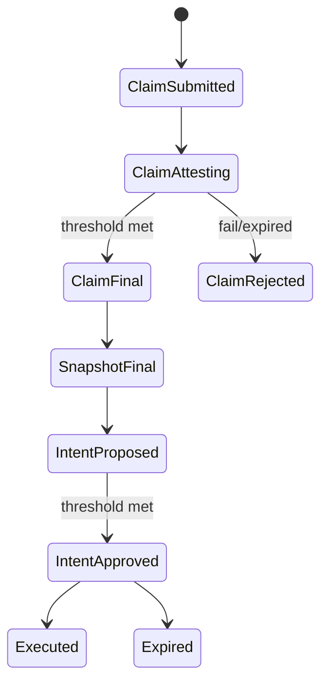
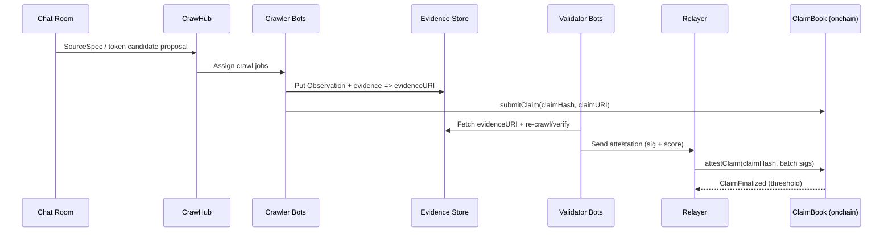
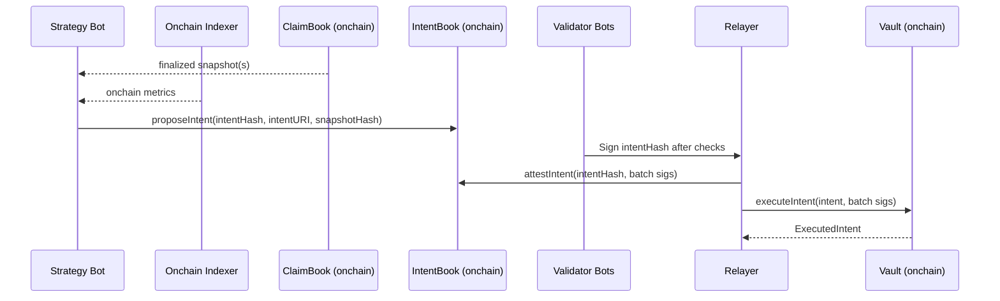

# ChatOps Swarm Fund Architecture (OpenClaw)

This document specifies a ChatOps-first architecture where a Telegram/Discord room becomes the control plane for:
- discovering meme coin candidates,
- crowdsourcing evidence-backed data mining (crawlers),
- validating data via independent validators (attestations),
- aggregating trust signals (relayers),
- and executing onchain intents through a vault with strict constraints.

Inspiration:
- Bittensor-style Miner/Validator dynamics (work + verification + incentives)
- Macrocosm Data Universe (open data mining/validation patterns)
- https://github.com/macrocosm-os/data-universe

## 1. Core Idea
OpenClaw turns chat-driven alpha into an enforceable pipeline:
1) Token candidates are discovered (Scout Bot).
2) A source definition is proposed (SourceSpec: URL + extractor + type + evidence policy).
3) Multiple crawlers produce observations for the same SourceSpec.
4) Multiple validators reproduce/verify and sign attestations (optionally with scores).
5) Relayers aggregate attestations into trust signals and finalize datasets/snapshots.
6) A strategy agent produces a structured Intent referencing the finalized dataset.
7) The vault executes onchain only if intent approvals and risk checks pass.

Important:
- LLM text is not a trust boundary. Execution is gated by signatures + onchain rules.
- Web crawling is offchain; the chain stores commitments, attestations, and settlements.

## 2. Visual Overview

### 2.1 System Diagram
```mermaid
flowchart LR
  subgraph Chat["Telegram/Discord (Chat Room)"]
    Users["Participants (LPs / Community)"]
    FundOps["FundOps Bot (Chat commands)"]
    Scout["Scout Bot (token discovery)"]
  end

  subgraph Hub["CrawHub (offchain hub)"]
    Skill["Skill Registry"]
    Spec["SourceSpec Registry"]
    Queue["Job Queue / Scheduler"]
    Evidence["Evidence Store (IPFS/HTTPS)"]
  end

  subgraph Bots["MoltBots (participant-run agents)"]
    Crawler["Crawler Bots (Miners)"]
    Validator["Validator Bots (Verifiers)"]
    Strategy["Strategy Bot (Decision agent)"]
  end

  subgraph Infra["Offchain Infra"]
    Indexer["Onchain Indexer"]
    Relayer["Relayer/Aggregator"]
  end

  subgraph Chain["Monad (onchain)"]
    ClaimBook["ClaimBook"]
    IntentBook["IntentBook"]
    Vault["Vault"]
    Gov["Governance + Multisig/Guardian"]
  end

  Users -->|/status /claims /vote| FundOps
  Scout -->|token candidates| Hub

  Skill --> Bots
  Spec --> Queue
  Queue --> Crawler
  Crawler -->|Observation + evidenceURI| Evidence
  Crawler -->|claimHash + claimURI| ClaimBook

  Validator --> Evidence
  Validator -->|attest (PASS/FAIL + score)| Relayer

  Relayer -->|finalize claims/snapshot| ClaimBook
  ClaimBook --> Strategy
  Indexer --> Strategy

  Strategy -->|propose intent| IntentBook
  Validator -->|sign intentHash| Relayer
  Relayer -->|attest intent| IntentBook
  IntentBook -->|approved intent| Vault

  Gov --> Vault
```

### 2.2 State Model (high level)


## 3. Components

### 3.1 Chat Layer (Telegram/Discord)
- Fund chat room: participants and bots live together.
- Chat commands: `/status`, `/portfolio`, `/watchlist`, `/claims <token>`, `/intent`, `/vote ...`.

### 3.2 CrawHub (offchain hub)
CrawHub is the coordination layer between chat and onchain enforcement.
- Skill registry: crawler/validator/indexer skill packages.
- SourceSpec registry: versioned definitions of "what to fetch and how to extract".
- Job queue/scheduler: assigns crawl/verify jobs to bots.
- Evidence store: stores raw responses, receipts, logs; returns `evidenceURI`.
- Reputation/scoring engine (optional): computes weights based on historical performance/SLA.

### 3.3 MoltBots (participant-run agents)
- Scout bot: finds token candidates from chat signals + optional external feeds.
- Crawler bot (Miner): executes SourceSpecs and produces observations.
- Validator bot (Verifier): reproduces/validates observations and signs attestations.
- FundOps bot: read-only status, links, safety guidance; does not custody funds.
- Strategy bot: consumes finalized datasets + onchain metrics, proposes intents.

### 3.4 Relayer network
Relayers aggregate attestations and submit batches onchain.
- Attestation aggregator: checks uniqueness, threshold, optional weighting.
- Onchain submitter: writes finalized claim/intent state and calls execution.

### 3.5 Onchain (Monad)
- ClaimBook / IntentBook: commitments, attestations, and finality.
- Vault: custody + execution under constraints (allowlists, slippage caps, caps, deadlines, cooldown).
- Governance + Multisig/Guardian: upgrades, parameter changes, emergency pause.

### 3.6 Onchain indexer (offchain)
Generates reproducible onchain metrics (price, liquidity, volume, holder distribution, etc.).
Onchain-derived claims are generally easier to validate because they are deterministically reproducible.

## 4. Recommended Data Model

### 4.1 SourceSpec
Defines where the alpha data is and how to extract it.
```json
{
  "sourceSpecId": "WEB_SCORE_V1",
  "sourceType": "WEB",
  "sourceRef": "https://example.com/token/{symbol}",
  "extractor": { "type": "CSS", "selector": ".score" },
  "valueType": "uint",
  "units": "count",
  "freshnessSeconds": 600,
  "evidencePolicy": "RECrawlConsensus",
  "notes": "stable sources only"
}
```

### 4.2 Observation (crawler output)
```json
{
  "sourceSpecId": "WEB_SCORE_V1",
  "token": "0xTokenOrSymbol",
  "timestamp": 1739000000,
  "extracted": "12345",
  "responseHash": "0x...",
  "evidenceURI": "ipfs://...or https://...",
  "crawler": "0xCrawlerAddress",
  "sig": "0xCrawlerSignature"
}
```

### 4.3 Attestation (validator output)
```json
{
  "subject": "claimHash-or-intentHash",
  "verdict": "PASS|FAIL",
  "score": 0.0,
  "confidence": 0.0,
  "reasonURI": "https://...optional",
  "validator": "0xValidatorAddress",
  "sig": "0xValidatorSignature"
}
```

### 4.4 Aggregated Claim (relayer output)
```json
{
  "claimHash": "0x...",
  "consensusValue": "12345",
  "trustScore": 0.87,
  "approvals": 7,
  "rejections": 1,
  "validators": ["0x..", "0x.."]
}
```

## 5. Workflows (Detailed)

### 5.1 Token discovery (Scout)
1) Scout bot computes a watchlist from chat signals (mentions, links, reactions) and optional external sources.
2) Watchlist is posted to chat (`/watchlist`).
3) Candidates become input to SourceSpec/Job Queue.

Notes:
- Treat scout outputs as suggestions. They must not directly influence execution without validation.

### 5.2 SourceSpec onboarding (what to crawl)
1) A participant proposes a SourceSpec: URL + extractor + value type + freshness + evidence policy.
2) Validator bots review SourceSpec safety and stability:
- Is it easy to spoof?
- Does it break often (selector fragility)?
- Is it phishing/malware risk?
3) Approved SourceSpecs are registered in CrawHub and scheduled.

### 5.3 Observation -> validation -> trust (data finality)
1) CrawHub assigns crawl jobs to multiple crawler bots.
2) Crawlers publish Observation JSON to storage and commit `claimHash + claimURI` onchain.
3) Validators reproduce the extraction (re-crawl) or verify cryptographic receipts (zkTLS/TEE).
4) Validators submit attestations to relayers.
5) Relayers aggregate attestations, compute trustScore, and finalize claims/snapshots onchain.

### 5.4 Decision -> intent -> execution (control finality)
1) Strategy bot reads:
- finalized dataset snapshot(s) from ClaimBook
- onchain metrics from the indexer
2) Strategy bot proposes a structured Intent referencing `snapshotHash`.
3) Validators sign `intentHash` if:
- it references finalized data,
- it fits risk constraints,
- it passes sanity checks.
4) Once intent threshold is met, Vault executes onchain.

### 5.5 Sequence diagrams (quick)

#### 5.5.1 Observation/Claim validation loop


#### 5.5.2 Intent execution loop


### 5.5 Governance and custody model
- Vault custody is managed by multisig (upgrades/pause/critical parameters).
- Trading execution is delegated to the agent pipeline, but bounded by:
- spending caps
- venue/token allowlists
- slippage + minOut
- deadlines + cooldown
- Governance votes adjust parameters; multisig executes changes (optionally via timelock).

## 6. User Experience (ChatOps)

### 6.1 Participants (fund members)
Goal: understand what the system is doing and why.
- `/status`: epoch, validation progress, vault balances, last execution, pending intents
- `/portfolio`: holdings + recent trades
- `/claims <token>`: claim list, trust scores, evidence links
- `/intent`: pending intent summary (why/constraints/who approved)
- `/vote <proposalId> <yes|no>`: governance actions (if enabled)

### 6.2 Bot operators (crawlers/validators)
Goal: run bots, earn points/rewards, build reputation.
1) Register in CrawHub with role + keys.
2) Install skills (crawler/validator/indexer).
3) Pick SourceSpecs or pull from the job queue.
4) Submit observations / attestations.
5) Track performance (`/leaderboard`, `/rewards`).

## 7. Bot Responsibilities (Clear Separation)

### 7.1 Scout bot
- Input: chat messages/links/reactions; optional external alpha sources.
- Output: token candidates with evidence links.
- Risk: manipulation/sandbagging. Must not be able to execute.

### 7.2 Crawler bot (Miner)
- Input: SourceSpec + token context.
- Output: Observation (value + evidenceURI + signature).
- Key: multiple independent crawlers for the same spec.

### 7.3 Validator bot (Verifier)
- Input: Observation + SourceSpec.
- Work: re-crawl/recompute or verify evidence (zkTLS/TEE).
- Output: signed Attestation (PASS/FAIL + score).

### 7.4 Relayer (Aggregator)
- Input: attestations.
- Work: threshold/uniqueness checks, trust scoring, batch submit.
- Output: finalized claim/intent states onchain.
- Key: must not have unilateral execution rights.

### 7.5 Strategy bot (Decision agent)
- Input: finalized snapshots + onchain metrics.
- Output: constrained Intent + explanation (reasonURI).
- Key: propose-only; execution is gated by approvals + vault rules.

### 7.6 FundOps bot (ChatOps)
- Input: participant commands.
- Output: read-only summaries, links, guidance.
- Key: do not handle custody or secret management in chat.

## 8. Trust Boundary / Threat Model (Production mindset)

### 8.1 What we trust
- Onchain constraints (allowlists, caps, slippage, expiry, thresholds)
- Signature verification (EIP-712 / ERC-1271)

### 8.2 What we do not trust by default
- LLM text output
- single crawler data
- single relayer

### 8.3 Safety mechanisms
- multisig + pause
- governance parameter changes (optionally timelocked)
- allowlist -> stake/reputation -> permissionless (progressive decentralization)

## 9. Gaps / Fixes (Feedback)
If you want this to survive adversarial conditions, the biggest gaps to address are:
1) Sybil/collusion resistance: start allowlisted, but define the path to stake-weighting + disputes/slashing.
2) Web data reproducibility: dynamic pages/AB tests/anti-bot break re-crawl consensus; define canonical fetch conditions and evidence formats.
3) Trust scoring design: define how scores are computed, how outliers are handled, and how validators are incentivized to be honest.
4) Chat manipulation: only validated datasets should feed the strategy; never let raw chat text become direct model context for trading.
5) Key safety: bot keys need strict separation, session keys, and spending limits (smart accounts recommended).
6) Execution safety: pre-trade quote checks, max exposure, circuit breakers, and a strict allowlist for venues.

## 10. Implementation Checklist (Next)
The first 5 items to lock down before writing lots of code:
1) Canonical encoding for SourceSpec/Observation -> claimHash
2) Attestation format (EIP-712 typed data, nonce/expiry)
3) Trust score algorithm (count -> weighted -> dispute/slash)
4) Chat command spec (minimal commands + permissions)
5) Vault risk rules (caps/slippage/expiry/allowlists/pause) + governance hooks
