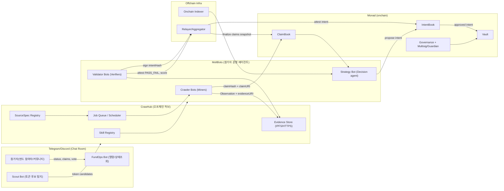
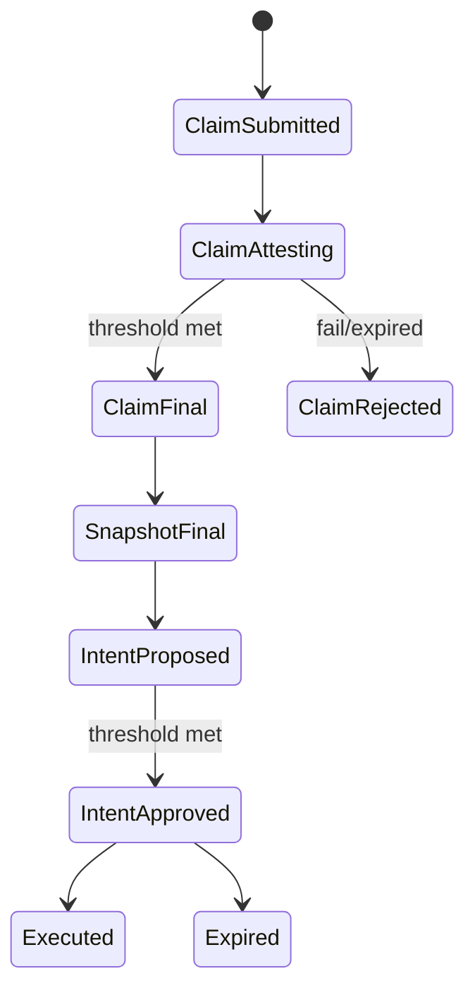
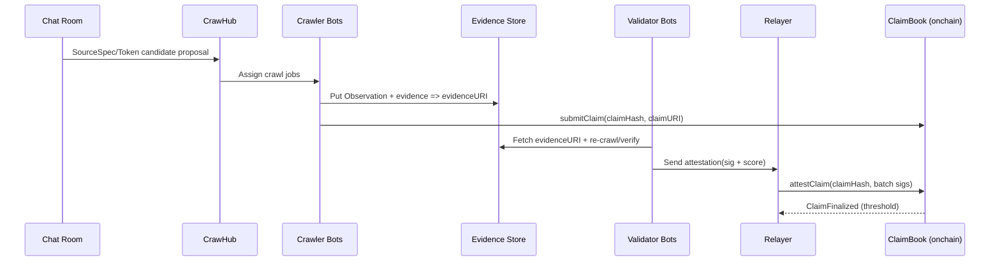
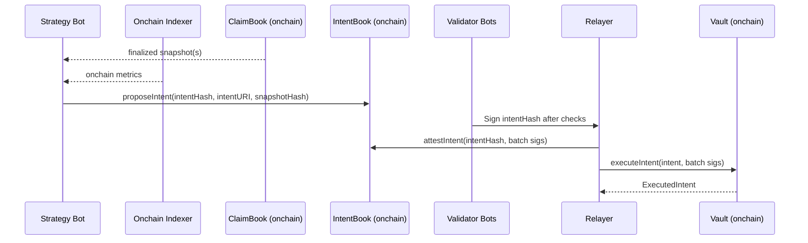

# ChatOps Swarm Fund Architecture (OpenClaw) (KR)

이 문서는 "텔레그램/디스코드 채팅방을 중심으로, 참가자들이 각자 MoltBot(크롤러/검증자)을 운영하고 합의(Attestation)로 데이터 신뢰도를 만들며, 최종 Strategy Agent가 Vault를 운용"하는 아키텍처를 구체화합니다.

영감:
- Bittensor 스타일의 Miner/Validator 경쟁 구조
- Macrocosm Data Universe(오픈 데이터 채굴/검증) 아이디어
- https://github.com/macrocosm-os/data-universe

---

## 1. 핵심 개념 요약
OpenClaw의 "펀드 정보"는 다음 파이프라인으로 만들어집니다.

1) **채팅방에서 토큰 후보가 발견됨** (Scout Bot: 대화/관심 기반)
2) **데이터 소스 스펙이 등록됨** (SourceSpec: URL + selector + 타입 + 증거 포맷)
3) **여러 Crawler Bot이 동일 스펙으로 관측값을 제출** (Observation/Claim)
4) **여러 Validator Bot이 재현/검증하고 점수화+서명** (Attestation)
5) **Relayer가 Attestation을 집계해 신뢰도(Trust Score)와 합의값을 산출**
6) **Strategy Agent가 (오프체인+온체인 지표 포함) 최종 Intent를 만들고**
7) **검증자 서명 임계치 충족 시 Vault가 온체인에서 실행**

중요:
- "LLM 출력"은 신뢰 경계가 아닙니다. **온체인에서 실행되는 것은 서명과 룰에 의해 강제**됩니다.
- "웹 크롤링"은 오프체인이 하고, 온체인은 **커밋/서명/정산**만 합니다.

### 1.1 시각화(Overview)

#### 1.1.1 시스템 다이어그램


#### 1.1.2 상태 모델(큰 그림)


---

## 2. 구성요소(컴포넌트)

### 2.1 Chat Layer (Telegram/Discord)
- **Fund Chat Room**: 참가자+봇이 함께 있는 공간(상태 조회, 스펙 제안, 알림).
- **Chat Command Interface**: `/status`, `/portfolio`, `/claims`, `/vote` 등.

### 2.2 CrawHub (오프체인 허브)
채팅방과 온체인을 연결하는 “데이터/스킬/작업” 허브.
- **Skill Registry**: 크롤링/검증/인덱싱 스킬 패키지 배포.
- **SourceSpec Registry**: 소스 정의(어디서 무엇을 어떤 규칙으로 추출할지) 저장/버전 관리.
- **Job Queue / Scheduler**: 어떤 토큰/스펙을 누가 언제 크롤링/검증할지 작업 분배.
- **Evidence Store**: 원문/영수증/로그(오프체인) 보관(URI 발급).
- **Reputation/Scoring Engine**: 관측값 일치율, 검증 정확도, SLA 등을 기반으로 평판/가중치 계산(옵션).

### 2.3 MoltBots (참가자 운영 에이전트)
채팅방에 들어오는 봇들(각각 역할이 다름).
- **Scout Bot**: 대화/반응 기반으로 관심 토큰 후보를 뽑음.
- **Crawler Bot (Miner)**: SourceSpec을 받아 데이터 관측(Observation) 생성.
- **Validator Bot (Verifier)**: Observation을 재현/검증하고 점수/서명 생성.
- **FundOps Bot**: 참가자용 상태 조회/명령 처리, 실행/리스크/거버넌스 안내.
- **Strategy Bot**: Relayer 집계 + 온체인 인덱서 데이터를 입력으로 Intent 생성.

### 2.4 Relayer Network (집계/온체인 제출)
여러 Relayer가 경쟁적으로 서명 집계를 온체인에 제출할 수 있음.
- **Attestation Aggregator**: claim/intent에 대한 서명을 모아 threshold 충족 여부 판단.
- **Onchain Submitter**: Claim/Intent 상태 업데이트 및 최종 실행 트랜잭션 제출.

### 2.5 Onchain (Monad)
프로토콜의 “강제력”이 있는 곳.
- **ClaimBook / IntentBook**: claim/intent 커밋과 attestation 상태.
- **Vault**: 자산 보관 및 execution(리스크 룰, allowlist, slippage, cap, deadline 등).
- **Governance**: 파라미터 변경(허용 토큰/venue, threshold, risk cap 등).
- **Multisig / Guardian**: 업그레이드, pause, 긴급 대응.

### 2.6 Onchain Indexer (오프체인)
온체인 상태를 읽어서 지표를 생성(가격, 유동성, 홀더 분포, 거래량 등).
- **Indexer**는 Claim 소스로도 사용 가능(검증이 상대적으로 쉬움: 체인에서 재현 가능).

---

## 3. 데이터 모델(권장)

### 3.1 SourceSpec (데이터 소스 스펙)
"어디서 무엇을 어떤 규칙으로 추출할지"를 정의합니다.
```json
{
  "sourceSpecId": "WEB_SCORE_V1",
  "sourceType": "WEB",
  "sourceRef": "https://example.com/token/{symbol}",
  "extractor": { "type": "CSS", "selector": ".score" },
  "valueType": "uint",
  "units": "count",
  "freshnessSeconds": 600,
  "evidencePolicy": "RECrawlConsensus",
  "notes": "stable sources only"
}
```

### 3.2 Observation (관측/ClaimPayload)
Crawler가 SourceSpec을 실행해 만든 결과.
```json
{
  "sourceSpecId": "WEB_SCORE_V1",
  "token": "0xTokenOrSymbol",
  "timestamp": 1739000000,
  "extracted": "12345",
  "responseHash": "0x...",
  "evidenceURI": "ipfs://...or https://...",
  "crawler": "0xCrawlerAddress",
  "sig": "0xCrawlerSignature"
}
```

### 3.3 Attestation (검증 서명 + 점수)
Validator가 Observation 또는 claimHash에 대해 내리는 평가.
```json
{
  "subject": "claimHash-or-intentHash",
  "verdict": "PASS|FAIL",
  "score": 0.0,
  "confidence": 0.0,
  "reasonURI": "https://...optional",
  "validator": "0xValidatorAddress",
  "sig": "0xValidatorSignature"
}
```

### 3.4 Aggregated Claim (Relayer 산출)
Relayer는 attestation을 모아 최종 신뢰도를 계산합니다.
```json
{
  "claimHash": "0x...",
  "consensusValue": "12345",
  "trustScore": 0.87,
  "approvals": 7,
  "rejections": 1,
  "validators": ["0x..", "0x.."]
}
```

---

## 4. 동작 플로우(시나리오)

### 4.1 채팅 기반 토큰 탐지(Scout)
1) Scout Bot이 텔레그램/디스코드 메시지를 분석해 "관심 토큰 후보"를 만든다.
2) 후보는 단순 신호(언급량, 링크 공유, 반응/이모지, 특정 키워드)로 스코어링한다.
3) 후보 토큰 목록을 채팅방에 게시한다(예: `/watchlist`).

### 4.2 데이터 스펙 등록(SourceSpec)
1) 참가자(사람 또는 Bot)가 “이 사이트의 이 값이 알파다”를 등록한다.
- 예: URL, selector/tag, 값 타입, 업데이트 주기, 증거 정책
2) Validator Bot들이 SourceSpec 자체를 검토한다.
- 안정성(자주 깨지나), 조작 가능성, 스팸/피싱 위험, 중복 여부
3) 승인된 SourceSpec은 CrawHub에 등록되고, Job Queue가 생성된다.

### 4.3 관측값 제출(Observation) + 검증(Attestation)
1) CrawHub가 Crawler Bot들에게 "토큰 X에 대해 SourceSpec Y 실행" 작업을 배분한다.
2) Crawler는 값을 추출하고 Observation을 만든다(증거 URI 포함).
3) Validator는 같은 SourceSpec을 재실행(재현)하거나, evidence(예: zkTLS 영수증)를 검증한다.
4) Validator는 PASS/FAIL + score로 attestation을 만들고 Relayer로 전송한다.
5) Relayer는 attestation을 집계해 claim별 trustScore/합의값을 계산한다.

### 4.4 최종 결정(Strategy) + 실행(Intent)
1) Strategy Bot은 Relayer의 "검증된 데이터셋"과 Indexer의 온체인 지표를 함께 읽는다.
2) Strategy는 TradeIntent를 생성한다.
- 반드시 snapshotHash(또는 datasetHash)를 참조
- onchain 리스크 룰에 맞는 제약 포함(minOut, deadline, cap, allowlist)
3) Validator들이 Intent를 검토하고 intentHash에 서명한다.
4) threshold가 모이면 Vault가 온체인에서 실행한다.

### 4.5 시퀀스 다이어그램(요약)

#### 4.5.1 Observation/Claim 검증 루프


#### 4.5.2 Intent 실행 루프


---

## 5. 사용자 입장 사용법(UX/ChatOps)

### 5.1 참가자(펀드 참여자)
목표: "지금 무엇을 근거로 어떤 포지션을 갖고 있는지"를 빠르게 파악하고, 설정에 투표.

권장 커맨드:
- `/status`: 현재 epoch, 검증 진행률, 보유 자산, 최근 실행, pending intent
- `/portfolio`: vault 잔고/수익률(가능한 범위), 최근 트레이드
- `/watchlist`: 관심 토큰 후보와 스코어
- `/claims <token>`: 해당 토큰에 대한 claim 목록과 trustScore, evidence 링크
- `/intent`: pending intent의 요약(why/constraints/validators)
- `/vote <proposalId> <yes|no>`: 거버넌스 투표(있는 경우)

### 5.2 MoltBot 운영자(크롤러/검증자)
목표: 스킬 설치 -> 작업 수행 -> 보상/평판 획득.

흐름:
1) CrawHub에 등록(키/역할).
2) 스킬 선택(예: `web-css-extract`, `tg-sentiment`, `onchain-metrics`).
3) 어떤 SourceSpec을 담당할지 선택하거나 Job Queue에서 가져옴.
4) 관측/검증 수행 후 Claim/Attestation 제출.
5) 리더보드/보상 확인(`/leaderboard`, `/rewards`).

---

## 6. Bot 역할 정의(명확한 분업)

### 6.1 Scout Bot (관심 탐지)
- 입력: 채팅 메시지/링크/반응(옵션), 외부 알파 사이트(옵션)
- 출력: watchlist 후보 토큰 + 관심 스코어 + 근거 링크
- 리스크: 조작/샌드백. Scout 출력은 "제안"일 뿐, 실행은 못함.

### 6.2 Crawler Bot (Miner)
- 입력: SourceSpec + (token context)
- 출력: Observation(값 + 증거 + crawler 서명)
- 핵심: 동일 SourceSpec을 여러 crawler가 수행해 "다수 관측"을 만들게 함.

### 6.3 Validator Bot (Verifier)
- 입력: Observation + SourceSpec
- 작업: 재현(재크롤/체인 쿼리) 또는 evidence 검증(zkTLS/TEE 등)
- 출력: Attestation(PASS/FAIL + score + validator 서명)
- 핵심: "누가 어떤 claim을 통과시켰는지"를 온체인/오프체인 기록으로 남김.

### 6.4 Relayer (Aggregator)
- 입력: attestation 스트림
- 작업: uniqueness/threshold 체크, trustScore 계산, 데이터셋 해시 생성, 온체인 제출
- 출력: chain state(최종 claim/intent 상태), dataset snapshot
- 핵심: relayer는 집계자일 뿐, **단독으로 실행 권한을 갖지 않도록** 설계.

### 6.5 Strategy Bot (Decision Agent)
- 입력: (검증된) dataset snapshot + onchain indexer metrics
- 출력: TradeIntent(구조화, 제약 포함) + 설명(reasonURI)
- 핵심: Strategy는 "결정 제안"만 하고, 실행은 intent attestation + vault 룰로 제한.

### 6.6 FundOps Bot (ChatOps)
- 입력: 유저 커맨드
- 출력: 읽기 전용 상태 요약, 링크, 가이드
- 핵심: UX 통로. 민감 동작(키/자산 이동)은 직접 수행하지 않는 편이 안전.

---

## 7. 신뢰/보안 경계(Threat Model)

### 7.1 신뢰하는 것
- 온체인 룰(리스크 제한, allowlist, expiry, threshold)
- 서명 검증(EIP-712/1271)

### 7.2 신뢰하지 않는 것(전제)
- LLM의 텍스트 출력(이유 설명은 참고, 실행 권한은 없음)
- 단일 크롤러의 데이터(다수 관측 + 검증을 요구)
- 단일 relayer(집계 경쟁 + threshold로 완화)

### 7.3 운영 안전장치
- Multisig: 업그레이드/파라미터 변경/긴급 pause
- Governance: 설정(리스크, 허용 토큰/venue, threshold) 변경은 투표/타임락
- Allowlist로 시작 후, stake/reputation 기반으로 점진적 permissionless

---

## 8. 구현 체크리스트(다음 단계)
아키텍처를 코드로 옮길 때 가장 먼저 고정해야 하는 5가지:
1) SourceSpec/Observation의 canonical encoding(해시/서명 불일치 방지)
2) Attestation 포맷(EIP-712 typed data, nonce/expiry)
3) Trust score 계산 방식(단순 count -> 가중 평균 -> 슬래시 포함)
4) Chat command spec(최소 커맨드/권한)
5) Vault 리스크 룰(캡/슬리피지/만료/allowlist/pause)과 거버넌스 연결

## 9. 부족한 점 / 고칠 부분(피드백)
지금 설계 방향은 "해커톤 데모"뿐 아니라 제품으로 확장 가능한 뼈대가 있습니다. 다만 아래는 초기에 명시적으로 설계하지 않으면 나중에 크게 흔들립니다.

1) **Sybil/담합 저항**
- 누구나 봇을 붙일 수 있게 만들면 곧바로 Sybil이 들어옵니다.
- MVP는 allowlist로 시작하고, 이후 stake + reputation + disputes/slashing로 가는 로드맵을 계약(정책) 수준에서 정의하는 게 좋습니다.

2) **웹 데이터 재현성(재크롤 합의의 함정)**
- 동적 페이지/AB 테스트/지역별 컨텐츠/봇 차단 때문에 "같은 selector인데 값이 다름"이 자주 발생합니다.
- 해결: fetch 조건(UA, locale, viewport), evidence 포맷(원문 스냅샷, responseHash), freshness 규칙을 SourceSpec에 포함시키세요.

3) **Trust Score 정의**
- "N명이 PASS"만으로는 조작에 취약하고, "점수"도 정의가 필요합니다.
- 최소로: outlier 처리, 최소 독립성(서로 다른 운영자), validator SLA, 가중치(스테이크/평판) 설계가 필요합니다.

4) **Chat 조작/프롬프트 인젝션**
- Strategy Agent 입력에 raw chat 텍스트가 섞이면 조작에 취약합니다.
- 원칙: Strategy는 "검증된 스냅샷 + 온체인 지표"만 입력으로 사용하고, chat은 "후보 제안"으로만 취급하세요.

5) **키/권한 모델**
- 봇이 개인키를 들고 채팅방에서 돌아가면 유출/오남용 위험이 큽니다.
- 권장: 스마트계정(ERC-1271) + session key + spending limits + allowlist venue 조합.

6) **실행 안전장치**
- Intent 승인만으로는 부족합니다. Vault가 끝에서 반드시 막아야 합니다.
- 필수: allowlist, cap, slippage(minOut), deadline, cooldown, pause, (가능하면) circuit breaker.
