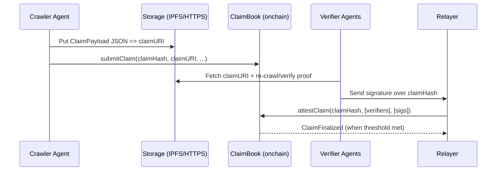
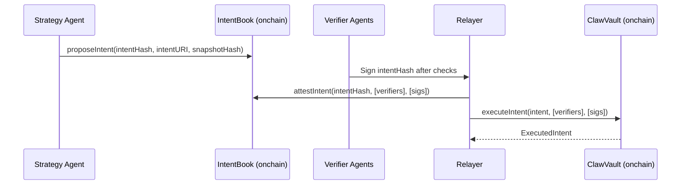

# Claw Architecture (Monad) (KR)

## 1. 전체 구조
Claw는 하이브리드 시스템입니다.
- 오프체인 에이전트가 수집/검증/의사결정을 수행(LLM/tooling).
- 온체인 컨트랙트가 검증 임계치, 리스크 제한, 실행을 강제합니다.

핵심 원칙:
> 오프체인에서 무엇이든 제안할 수는 있지만, 검증되고 제약된 Intent만 온체인에서 실행 가능하다.

## 2. 구성 요소
### 2.1 온체인 (Solidity)
MVP 기준 최소 컨트랙트 셋:
1) `AgentRegistry` (MVP에서는 optional; allowlist-only로 시작 가능)
2) `ClaimBook` (Claim + Claim attestation + snapshot finalize)
3) `IntentBook` (Intent proposal + intent attestation)
4) `ClawVault` (자산 보관 + 실행 + 리스크 컨트롤)
5) `Points` (optional; 데모용 포인트/리워드 회계)

### 2.2 오프체인
- Crawler agent(s)
  - 소스 fetch, 필드 추출, ClaimPayload 계산, claimURI 게시, claimHash 제출.
- Verifier agent(s)
  - 재크롤 또는 proof 검증, claimHash 및/또는 intentHash 서명.
- Strategy agent
  - finalized snapshot을 읽고 신호 계산, TradeIntent + 설명 생성.
- Relayer/Aggregator (stateless)
  - verifier들의 ECDSA 서명 수집 후, 배치 tx를 온체인 제출.
  - 누구나 운영 가능; relayer는 복수여도 OK.
- Storage
  - ClaimPayload/Intent JSON을 오프체인에 저장(IPFS/S3/HTTPS).
- Proof service (optional)
  - zkTLS 영수증 등 evidence 생성.

## 3. 데이터 모델
### 3.1 ClaimPayload (오프체인 JSON)
예시 스키마(ASCII-only; 필요 시 단순화):
```json
{
  "schemaId": "SOCIAL_SCORE_V1",
  "sourceType": "WEB",
  "sourceRef": "https://example.com/token/XYZ",
  "selector": ".score",
  "extracted": "12345",
  "extractedType": "uint",
  "timestamp": 1739000000,
  "responseHash": "0x...",
  "evidenceType": "RECrawlConsensus",
  "evidenceURI": "ipfs://...",
  "crawler": "0xCrawlerAgentAddress",
  "notes": "optional"
}
```

온체인에는 아래만 저장합니다.
- `claimHash` (ClaimPayload 필드의 canonical encoding에 대한 keccak256)
- `claimURI` (JSON 포인터)
- 최소 메타데이터(schemaId, timestamp, sourceType)

### 3.2 Claim Attestation
- Verifier는 EIP-712 typed data에 서명:
  - `ClaimAttestation(claimHash, epochId, verifier, expiresAt, nonce)`
- Relayer는 배치 제출:
  - `attestClaim(claimHash, verifierAddrs[], sigs[])`

### 3.3 Snapshot
- epoch마다:
  - `snapshotHash = keccak256(abi.encode(epochId, orderedClaimHashes))`
- Snapshot 저장 방식:
  - `snapshotHash` + `snapshotURI`만 저장하거나
  - claimHashes 배열이 작으면 온체인에 배열 저장(MVP OK)

### 3.4 TradeIntent (오프체인 JSON + 온체인 struct)
Intent JSON:
```json
{
  "intentVersion": "V1",
  "vault": "0xVault",
  "action": "BUY",
  "tokenIn": "0xUSDC",
  "tokenOut": "0xMEME",
  "amountIn": "1000000",
  "minAmountOut": "123",
  "deadline": 1739003600,
  "maxSlippageBps": 50,
  "snapshotHash": "0x...",
  "reason": "hash-only onchain; full text here"
}
```

온체인 `intentHash`는 중요한 필드를 커밋합니다.
- `intentHash = keccak256(abi.encode(V1, vault, action, tokenIn, tokenOut, amountIn, minAmountOut, deadline, maxSlippageBps, snapshotHash))`

### 3.5 Intent Attestation
- Verifier는 EIP-712 typed data에 서명:
  - `IntentAttestation(intentHash, verifier, expiresAt, nonce)`
- 배치 제출:
  - `attestIntent(intentHash, verifierAddrs[], sigs[])`

## 4. 스마트 컨트랙트 인터페이스 (MVP 스케치)
### 4.1 AgentRegistry (optional)
목적: 누가 attest할 수 있는지 제한; allowlist로 시작 가능.
- `registerAgent(address agent, string agentURI)`
- `setVerifier(address agent, bool isVerifier)`
- `setCrawler(address agent, bool isCrawler)`

### 4.2 ClaimBook
- `submitClaim(bytes32 claimHash, string claimURI, uint64 timestamp, bytes32 schemaId) returns (uint256 claimId)`
- `attestClaim(bytes32 claimHash, address[] verifiers, bytes[] sigs)`
- `finalizeClaim(bytes32 claimHash)` (임계치 도달 시 자동 finalize면 optional)
- `finalizeSnapshot(uint64 epochId, bytes32[] claimHashes, string snapshotURI) returns (bytes32 snapshotHash)`

Events:
- `ClaimSubmitted(claimHash, claimURI, schemaId, timestamp, crawler)`
- `ClaimAttested(claimHash, verifier)`
- `ClaimFinalized(claimHash)`
- `SnapshotFinalized(epochId, snapshotHash, snapshotURI)`

### 4.3 IntentBook
- `proposeIntent(bytes32 intentHash, string intentURI, bytes32 snapshotHash)`
- `attestIntent(bytes32 intentHash, address[] verifiers, bytes[] sigs)`
- `isIntentApproved(bytes32 intentHash) view returns (bool)`

Events:
- `IntentProposed(intentHash, intentURI, snapshotHash, proposer)`
- `IntentAttested(intentHash, verifier)`
- `IntentApproved(intentHash)`

### 4.4 ClawVault
- `deposit(uint256 amount)` / `withdraw(uint256 shares)`
- `executeIntent(TradeIntent intent, address[] verifiers, bytes[] sigs)`

리스크 컨트롤(온체인 강제):
- token/router allowlist
- `maxTradeAmount`, `maxSlippageBps`, `cooldownSeconds`
- daily loss limit (optional)
- emergency pause

Events:
- `Deposited(user, amount, shares)`
- `Withdrew(user, shares, amount)`
- `ExecutedIntent(intentHash, tokenIn, tokenOut, amountIn, amountOut)`

## 5. 시퀀스 다이어그램
### 5.1 Claim 검증


### 5.2 Intent 실행


## 6. 신뢰/위협 모델 (MVP)
### 6.1 가정
- 오프체인 계산은 신뢰하지 않음; 서명과 온체인 룰만이 사실상 보안 경계.
- Relayer가 악성일 수 있으나, 충분한 verifier 서명 없이는 실행 불가.
- Verifier가 부정직할 수 있음; MVP에서는 threshold + allowlist로 완화.

### 6.2 위협과 완화
- Sybil verifiers: MVP allowlist; 이후 stake + identity + reputation weighting.
- Data lies: evidenceURI 요구 + 독립 verifier 다수.
- Intent manipulation: vault에서 allowlist + minOut + deadline + caps 강제.
- Replay attacks: EIP-712 typed data에 nonce/expiry 포함.
- MEV: 작은 사이즈 + 타이트한 슬리피지; 이후 private tx 고려.

## 7. ERC-8004 매핑 (옵션 / 향후)
ERC-8004 "Trustless Agents"에 맞추려면:
- `AgentRegistry` -> Identity Registry(agentId/agentURI)에 준하는 역할
- `Points/Reputation` -> Reputation Registry(피드백 신호)에 준하는 역할
- `ClaimBook/IntentBook` -> Validation Registry(requestHash -> response)와 유사

MVP는 단순 registry로 시작하고, 이후 ERC-8004-compliant 구현으로 교체/어댑팅할 수 있습니다.

## 8. MVP 구현 노트
- 온체인 저장은 최소화(해시 + URI + 카운터).
- 이벤트를 충분히 설계하고, 데모용 인덱싱은 스크립트로 빠르게.
- MVP는 allowlisted verifiers로 sybil 복잡도를 피함.
- DEX 통합 리스크를 줄이려면 데모용 AMM을 직접 배포(결정적 데모).

